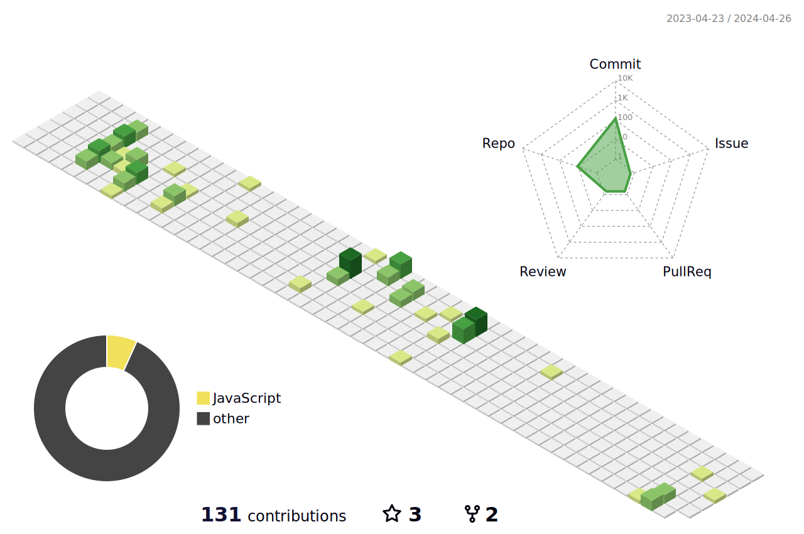

# 个人简介

| 📖ObjectX📖 🎈 前端工程师 🎈    [📚 掘金](https://juejin.cn/user/3714595004887192)｜[⚙️ 个人网站](https://object-x.com.cn/)｜[🔖 知识库](https://nextjs-notion-starter-kit-phi-gray.vercel.app/?vercelToolbarCode=q7e6XSyBgBIeMSk)｜[🚀CodeSandbox](https://codesandbox.io/u/ObjectX) |  |
| ------------------------------------------------------------ | ------------------------------------------------------------ |
|  |  |
|                                                              |                                                              |

  # 指标

  # 进行中

优先级顺序

- [JS 手写](https://github.com/ObjectX-9/handwriting_js)

- [重学React&实现一个mini React](https://github.com/ObjectX-9/React)

- [前端复习大纲](https://github.com/ObjectX-9/Front_end_knowledge_outline)

- [前端资源](https://github.com/ObjectX-9/ResourceArrangement)

- [个人网站完善](https://github.com/ObjectX-9/myweb)

- [博客接口完善](https://github.com/ObjectX-9/myweb_backend)

- [react demo 一个用来写一些react组件、动画demo的仓库](https://github.com/ObjectX-9/react_demo)

# TODO

- [每日 TODO](https://zhuling.notion.site/6756ff3cf1204075bf137c2e327e603c#7f552f25625d477c9ccbb65d7c0b3062)
